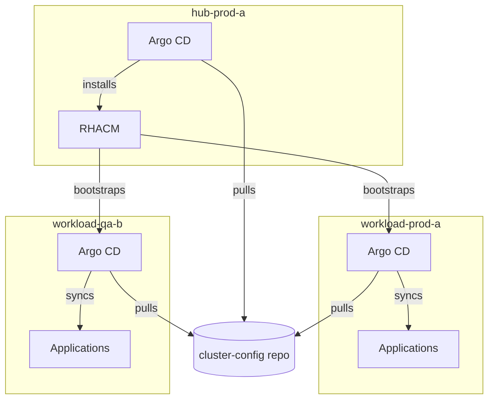
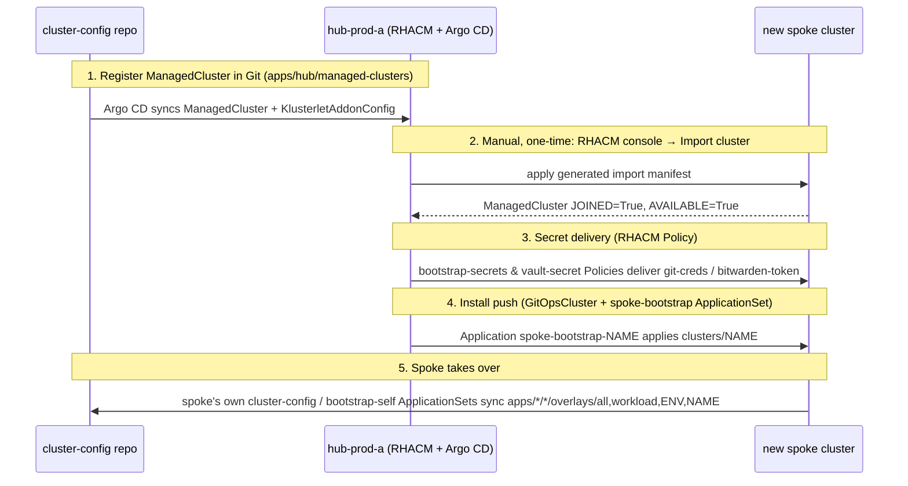

# cluster-config

A runnable reference implementation of the pattern described in **"Kustomize
your multi-cluster OpenShift fleet with OpenShift GitOps"** (session BO1544,
Red Hat One 2026, Las Vegas).

The core components of this pattern are:

- **[Kustomize](https://kustomize.io/)** - plain-YAML, overlay-based
  configuration. No templating language, no extra abstraction layer.
- **[OpenShift GitOps](https://docs.redhat.com/en/documentation/red_hat_openshift_gitops)
  (Argo CD)** - every cluster, hub included, runs its own Argo CD instance
  and pulls its own configuration from this repo.

Additional optional components:

- **[RHACM](https://docs.redhat.com/en/documentation/red_hat_advanced_cluster_management_for_kubernetes)
  (Red Hat Advanced Cluster Management for Kubernetes)** - can be used for bootstrapping gitops
  configuration on spoke/managed clusters (OpenShift GitOps Operator and Argo CD `ApplicationSets`).
  RHACM is not required for this pattern to be used but makes automatically bootstrapping new clusters
  more straightforward. In environments without RHACM you may need to use other tools to bootstrap
  gitops configuration (e.g. bash scripts, Ansible).
- **[External Secrets Operator](https://docs.redhat.com/en/documentation/openshift_container_platform/4.22/html/security_and_compliance/external-secrets-operator-for-red-hat-openshift)** -
  Used for deploying secrets that can't be stored in git. This example repo connects to an
  external [Bitwarden Secret Manager instance](https://bitwarden.com/products/secrets-manager/)
  via the `bitwardensecretsmanager` `ClusterSecretStore` provider. In this example, vault
  secrets are copied to spoke clusters via RHACM policies.

## Contents

- [Cluster layout and classification](#cluster-layout-and-classification)
- [Overlay convention → repo layout](#overlay-convention--repo-layout)
- [Bootstrapping](#bootstrapping)
- [Demo](#demo)
- [CI/CD](#cicd)
- [Repo reference](#repo-reference)

## Cluster layout and classification

This repo's example fleet is one hub and two spokes ("workload" clusters):

| Cluster | `type` | `env` | Role |
|---|---|---|---|
| `hub-prod-a` | `hub` | `hub-prod` | Runs RHACM and the fleet's control-plane Argo CD |
| `workload-prod-a` | `workload` | `workload-prod` | Spoke — production bookinfo/mesh demo |
| `workload-qa-b` | `workload` | `workload-qa` | Spoke — QA bookinfo/mesh demo |



Each cluster's `type` and `env` decide exactly which overlay directories its
`cluster-config` ApplicationSet picks up. Here's what that ApplicationSet
looks like once deployed on `workload-prod-a`:

```yaml
# cluster-config ApplicationSet as deployed on workload-prod-a
apiVersion: argoproj.io/v1alpha1
kind: ApplicationSet
metadata:
  name: cluster-config
spec:
  generators:
    - git:
        repoURL: git@github.com:ayjM6/cluster-config.git
        revision: HEAD
        directories:
          - path: apps/*/*/overlays/all
          - path: apps/*/*/overlays/workload
          - path: apps/*/*/overlays/workload-prod
          - path: apps/*/*/overlays/workload-prod-a
```

Every app overlay directory matching one of those four globs becomes its own
Argo CD `Application`. For example, `apps/workload/bookinfo/overlays/workload-prod`
matches, so `cluster-config` renders this `bookinfo` Application:

```yaml
# Application generated by the cluster-config ApplicationSet on workload-prod-a
apiVersion: argoproj.io/v1alpha1
kind: Application
metadata:
  name: bookinfo
  labels:
    type: workload
spec:
  project: default
  source:
    repoURL: git@github.com:ayjM6/cluster-config.git
    targetRevision: HEAD
    path: apps/workload/bookinfo/overlays/workload-prod
  destination:
    name: in-cluster
  syncPolicy:
    automated:
      enabled: true
      selfHeal: true
      prune: true
```

`workload-qa-b` gets the same `bookinfo` Application, just pointed at
`overlays/workload-qa` instead — see [Setting a cluster's
`type`/`env`/`name`](#setting-a-clusters-typeenvname) for how that value
gets set per cluster and turned into a path.

These same `type`/`name` values are also mirrored onto the `ManagedCluster`
object RHACM uses on the hub, so cluster selection stays consistent whether
it's driven by a Kustomize overlay path or an RHACM label selector.

> **Note on naming:** `type`/`env` and the cluster names built from them
> (`hub-prod-a`, `workload-prod-a`, `workload-qa-b`) are just this repo's
> example classification scheme. Any taxonomy works as long as your overlay
> directory names line up with what the ApplicationSets glob for — swap in
> region, business unit, tier, or whatever fits your fleet, and the same
> matching mechanism keeps working.

## Overlay convention → repo layout

Every app in this repo follows the same shape: a `base/` (or `operator/` +
`instance/` for anything that ships its own operator) holding the
cluster-agnostic manifests, and an `overlays/` directory holding one overlay
per deployment target:

```
apps/<layer>/<app>/
├── base/               # cluster-agnostic manifests
└── overlays/
    ├── all/                    # every cluster, regardless of type/env/name
    ├── <type>/                 # every cluster of this type (hub | workload)
    ├── <env>/                  # every cluster of this env (hub-prod | workload-prod | workload-qa)
    └── <name>/                 # exactly one cluster (hub-prod-a | workload-prod-a | workload-qa-b)
```

An app only needs the overlay directories it actually uses — one of
`all`, `<type>`, `<env>`, or `<name>`.

> **Note:** to avoid duplicate applications being generated by the `ApplicationSet`, only one overlay
> can exist per cluster in each app. e.g. an app can't have both a `workload` overlay and a
> `workload-prod` overlay, since a `type=workload, env=workload-prod` cluster would match both and
> get two `Application`s with the same name.

In this example, apps are also grouped by type, for ease of organisation of the repo:
```
apps/
├── bootstrap/    # OpenShift GitOps itself + the ApplicationSets that drive everything else
│   ├── openshift-gitops/       # operator + ArgoCD instance — overlays/all
│   └── gitops-applications/    # cluster-config & bootstrap-self ApplicationSets — overlays/<name>
├── core/         # deployed on every cluster
│   ├── cluster-banner/          # overlays/hub-prod-a, overlays/workload-prod-a, overlays/workload-qa-b
│   └── openshift-external-secrets/  # overlays/all
├── hub/          # hub clusters only
│   ├── advanced-cluster-management/
│   ├── managed-clusters/        # registers spokes with RHACM
│   ├── gitops-bootstrap-policies/  # RHACM Policies that deliver secrets to spokes
│   └── spoke-bootstrap/         # pushes GitOps install onto each spoke
└── workload/     # workload clusters only
    ├── bookinfo/                 # overlays/workload-prod, overlays/workload-qa
    └── openshift-service-mesh/   # overlays/workload
```

`clusters/<name>/` is each cluster's Argo CD sync root — see
[Bootstrapping](#bootstrapping) for how it gets applied to the hub and
pushed out to each spoke.
```
clusters/
├── hub-prod-a/kustomization.yaml
├── workload-prod-a/kustomization.yaml
└── workload-qa-b/kustomization.yaml
```

### Worked example 1 — one overlay per cluster name

[`apps/core/cluster-banner/`](apps/core/cluster-banner) shows a plain
OpenShift `ConsoleNotification` whose content is entirely per-cluster:

```
apps/core/cluster-banner/
├── base/
│   └── consolenotification.yaml   # spec.text left as a patch target
└── overlays/
    ├── hub-prod-a/patch-consolenotification.yaml       # "Cluster: hub-prod-a, Type: hub, Environment: hub-prod" (blue)
    ├── workload-prod-a/patch-consolenotification.yaml  # "Cluster: workload-prod-a, Type: workload, Environment: workload-prod" (green)
    └── workload-qa-b/patch-consolenotification.yaml    # "Cluster: workload-qa-b, Type: workload, Environment: workload-qa" (red)
```

```yaml
# apps/core/cluster-banner/overlays/workload-qa-b/patch-consolenotification.yaml
apiVersion: console.openshift.io/v1
kind: ConsoleNotification
metadata:
  name: cluster-banner
spec:
  text: "Cluster: workload-qa-b, Type: workload, Environment: workload-qa"
  color: "#ffffff"
  backgroundColor: "#c9190b"
```

### Worked example 2 — one overlay per environment

[`apps/workload/bookinfo/`](apps/workload/bookinfo) pins the Service Mesh
`reviews` service to a different version per environment via a Gateway API
`HTTPRoute`, layered on the same base:

```
apps/workload/bookinfo/
├── base/
│   ├── kustomization.yaml   # namespace + route + remote bookinfo manifests
│   ├── namespace.yaml
│   └── route.yaml
└── overlays/
    ├── workload-prod/
    │   ├── kustomization.yaml         # resources: [../../base, httproute-reviews-v2.yaml]
    │   └── httproute-reviews-v2.yaml  # pins reviews to v2 (black stars)
    └── workload-qa/
        ├── kustomization.yaml         # resources: [../../base, httproute-reviews-v3.yaml]
        └── httproute-reviews-v3.yaml  # pins reviews to v3 (red stars)
```

Because `workload-prod-a` is `env=workload-prod` and `workload-qa-b` is
`env=workload-qa`, this one app resolves to a different reviews version on
each spoke with no per-cluster overlay needed at all.

### Setting a cluster's `type`/`env`/`name`

Each cluster's `type`, `env`, and `name` are set via a `vars` ConfigMap in
that cluster's overlay under
[`apps/bootstrap/gitops-applications/overlays/<cluster>/kustomization.yaml`](apps/bootstrap/gitops-applications/overlays).
For example, `workload-prod-a`'s overlay:

```yaml
# apps/bootstrap/gitops-applications/overlays/workload-prod-a/kustomization.yaml
resources:
  - ../../bases/workload      # brings in type=workload from bases/workload/kustomization.yaml
components:
  - ../../components/namespace
  - ../../components/replace-vars
configMapGenerator:
  - name: vars
    behavior: merge
    literals:
      - name=workload-prod-a
      - env=workload-prod
```

`type` isn't set directly in each cluster's overlay — it comes for free from
which *base* the overlay points at
([`bases/hub`](apps/bootstrap/gitops-applications/bases/hub) vs.
[`bases/workload`](apps/bootstrap/gitops-applications/bases/workload)), so a
cluster can't accidentally end up with an inconsistent `type`.

These `vars` values don't just sit in a ConfigMap — a Kustomize
[`replace-vars`
Component](apps/bootstrap/gitops-applications/components/replace-vars) uses
`replacements` to substitute `data.type`, `data.env`, and `data.name` into
the `cluster-config` and `bootstrap-self` ApplicationSets' own generator
directories (`spec.generators.0.git.directories.*.path`). That's what turns
this cluster's classification into the four resolved `apps/*/*/overlays/...`
paths you saw in [Cluster layout and
classification](#cluster-layout-and-classification) — an overlay directory
name alone is enough to decide "does this app land on this cluster," with
no per-cluster app list to maintain.

## Bootstrapping

### Hub bootstrap

`clusters/hub-prod-a/kustomization.yaml` is the literal root manifest for the hub:

```yaml
resources:
  - ../../apps/bootstrap/openshift-gitops/overlays/all
  - ../../apps/bootstrap/gitops-applications/overlays/hub-prod-a
```

Bootstrapping a bare hub cluster is three steps (full detail, including the
exact secret-seeding scripts, in [`docs/demo.md`](docs/demo.md)):

1. **Seed secrets** — run `scripts/bootstrap-git-secret.sh` (and optionally
   `scripts/bootstrap-vault-secret.sh`) against the bare cluster. This writes
   the `git-creds` Secret Argo CD needs to pull this repo, before Argo CD
   itself exists.
2. **Install OpenShift GitOps**:
   `oc apply -k apps/bootstrap/openshift-gitops/overlays/all`
3. **Bootstrap the rest of the fleet from Git**:
   `oc apply -k apps/bootstrap/gitops-applications/overlays/hub-prod-a`

Step 3 deploys the `cluster-config` and `bootstrap-self` ApplicationSets from
[the section above](#setting-a-clusters-typeenvname),
which — because this cluster is `type=hub, env=hub-prod, name=hub-prod-a` —
pull in RHACM, External Secrets Operator, and the hub-only apps that drive
the rest of the fleet: `managed-clusters`, `gitops-bootstrap-policies`, and
`spoke-bootstrap`. From this point on `bootstrap-self` keeps
`clusters/hub-prod-a` in sync — the two manual `oc apply -k` commands above
are the *only* manual steps on the hub.

### Onboarding a new spoke

Getting a new spoke cluster from "provisioned" to "fully managed" combines
GitOps automation with two manual steps. Note that these manual steps may
not be required in environments where clusters are provisioned fully with
RHACM (this example repo only creates `ManagedCluster` and `KlusterletAddonConfig`
resources for the managed spoke clusters).



Concretely, in this repo:

1. **Register the cluster in Git** — add a `ManagedCluster` +
   `KlusterletAddonConfig` component under
   [`apps/hub/managed-clusters/components/<name>/`](apps/hub/managed-clusters/components)
   (mirroring `components/workload-prod-a`), labeled `type: workload`,
   `name: <name>`, and
   `cluster.open-cluster-management.io/clusterset: workload`, then reference
   it from
   [`apps/hub/managed-clusters/overlays/hub-prod-a/kustomization.yaml`](apps/hub/managed-clusters/overlays/hub-prod-a).
2. **Import the cluster into RHACM** — manual, one-time: RHACM console →
   *Infrastructure → Clusters → Import cluster*, then apply the generated
   manifest against the new spoke's own context.
3. **Secrets arrive via RHACM Policy** — once joined, the cluster matches the
   `workload-clusters` Placement in
   [`apps/hub/gitops-bootstrap-policies`](apps/hub/gitops-bootstrap-policies)
   and receives the `bootstrap-secrets` and `vault-secret` Policies, which
   hub-template `git-creds` / `bitwarden-token` onto the spoke.
4. **GitOps install is pushed** — a
   [`GitOpsCluster`](apps/hub/spoke-bootstrap/base/gitopscluster.yaml)
   registers the new spoke as an Argo CD destination on the hub, and the
   `spoke-bootstrap`
   [`ApplicationSet`](apps/hub/spoke-bootstrap/base/appset-spoke-bootstrap.yaml)
   (a *cluster generator*, `matchLabels: {type: workload}`) creates
   `Application spoke-bootstrap-<name>` pointing at `clusters/<name>` in this
   repo — applying the same manifests hub-prod-a's own bootstrap applied by
   hand.
5. **Add `clusters/<name>/kustomization.yaml`** (mirroring
   `clusters/workload-prod-a`) and a matching
   `apps/bootstrap/gitops-applications/overlays/<name>/` with the new
   cluster's `vars` (`name=<name>`, `env=<env>`) — this is what step 4
   actually applies.
6. From here the spoke's own `cluster-config`/`bootstrap-self`
   ApplicationSets take over, pulling in `openshift-service-mesh`,
   `bookinfo`, and everything else matching its `type`/`env`/`name`.

Note steps 3 and 4 are deliberately two separate mechanisms — secret delivery
(RHACM Policy) and GitOps installation (`GitOpsCluster` + ApplicationSet
push) don't depend on each other, which makes each independently
debuggable. See [`docs/demo.md`](docs/demo.md) for the exact commands and
what to check at each step, including a full RHACM-import walkthrough for
two spokes.

## Demo

[`docs/demo.md`](docs/demo.md) is a full, runnable walkthrough of everything
above: bootstrap a hub cluster, import two spoke clusters into RHACM, and
watch them come up running [OpenShift Service Mesh
3](https://docs.redhat.com/en/documentation/red_hat_openshift_service_mesh)
with the [Istio `bookinfo`](https://istio.io/latest/docs/examples/bookinfo/)
sample app behind it — `workload-prod-a` (workload-prod) pinned to `reviews`
v2, `workload-qa-b` (workload-qa) pinned to v3, routed through the mesh's
Gateway API `HTTPRoute` and out an OpenShift `Route`. Successfully loading
`/productpage` with reviews
visible proves sidecar injection, mesh routing, and Gateway API wiring all
worked end to end.

It covers prerequisites (three OpenShift clusters, a deploy key, optional
Bitwarden token for External Secrets Operator) and every command from a bare
hub cluster through to a working demo — see the doc for the full script.

## CI/CD

Every PR into `main` gets a **semantic diff** of the actual rendered
Kubernetes manifests for whatever it touched, not just a source diff of the
Kustomize YAML. [`.github/workflows/kustomize-diff.yaml`](.github/workflows/kustomize-diff.yaml)
finds the overlays affected by the PR (including anything that transitively
depends on a changed file — bases, components, patches, generators), builds
them for both the PR branch and `main`, diffs the two trees with
[`dyff`](https://github.com/homeport/dyff), and posts the result to the PR's
Actions job summary.

Run the same check locally with [`just`](Justfile):

```bash
just dyff origin/main human
```

Full detail — including the individual scripts and how to install the Go
tooling — is in [`docs/ci-cd.md`](docs/ci-cd.md).

## Repo reference

| Path | Contents |
|---|---|
| [`apps/`](apps) | All app manifests (`base/` + `overlays/`), grouped into `bootstrap/`, `core/`, `hub/`, `workload/` |
| [`clusters/`](clusters) | One directory per cluster — the actual Argo CD sync root for that cluster |
| [`catalog/`](catalog) | Shared Kustomize Components reused across apps (e.g. sync-wave annotations) |
| [`scripts/`](scripts) | Bootstrap and CI helper scripts |
| [`docs/`](docs) | The talk deck, [`demo.md`](docs/demo.md), and [`ci-cd.md`](docs/ci-cd.md) |
| [`Justfile`](Justfile) | `just build`, `just changed`, `just dyff`, `just clean` |
